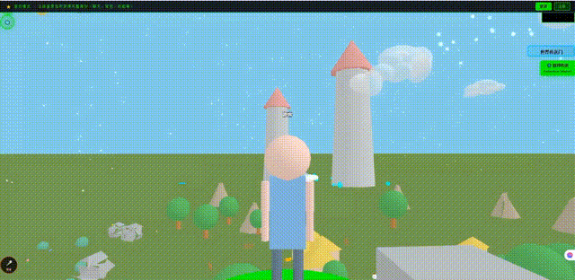
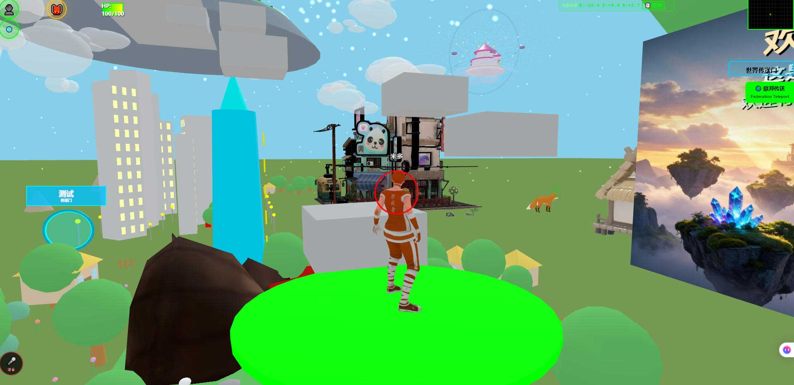
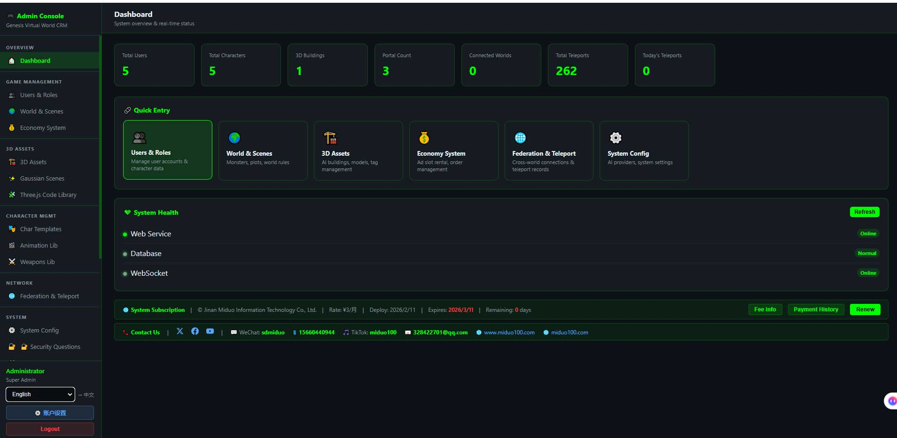
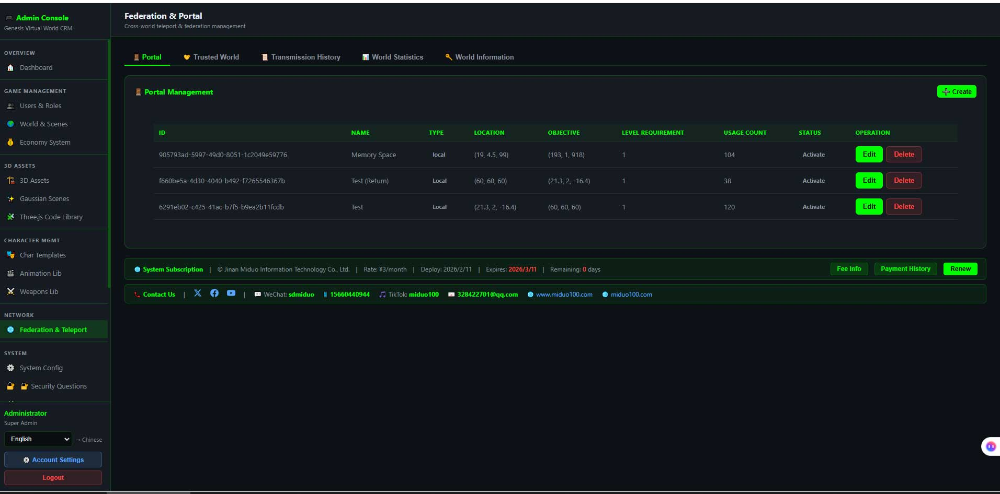
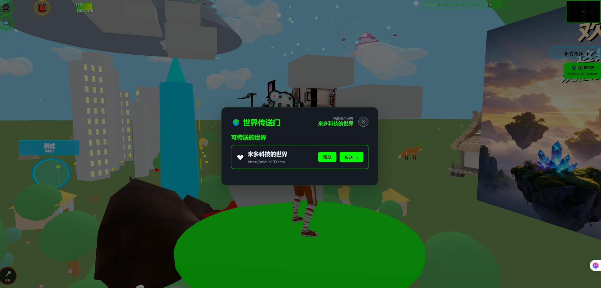
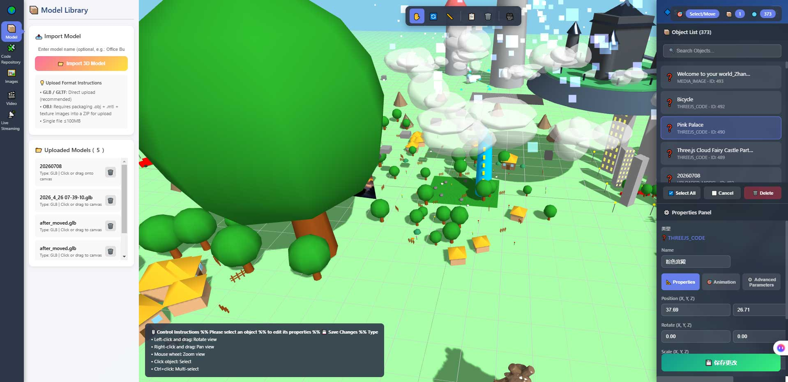
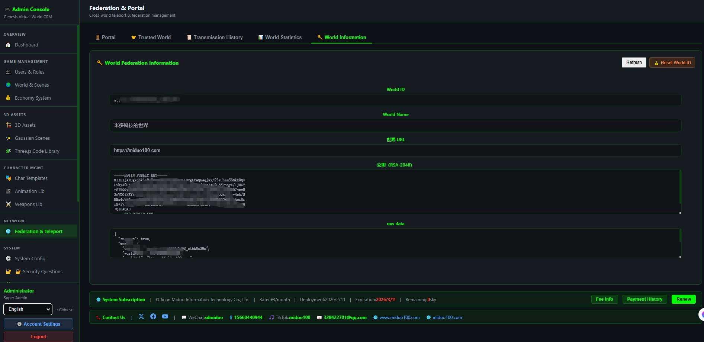
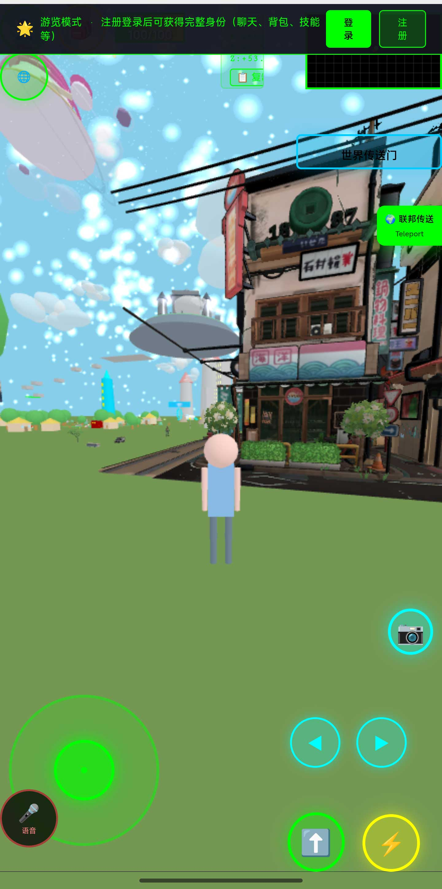
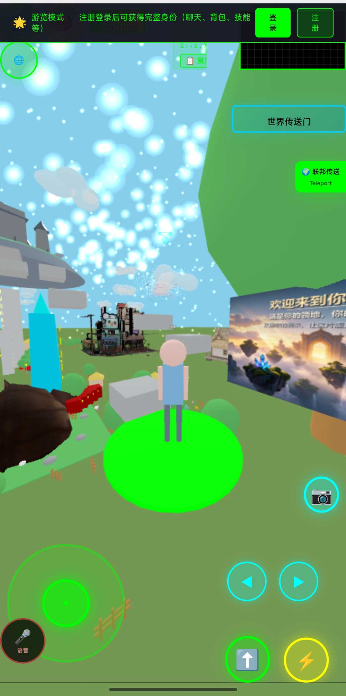

# Virtual World — 3D Multiplayer Virtual World Platform

> 🌐 English | [简体中文](./README_CN.md)

[](./LICENSE)
[](https://nodejs.org)
[](https://www.postgresql.org)
[](https://threejs.org)
[](https://miduo100.com/)



> An immersive 3D multiplayer virtual world system built on Three.js + Express.js + PostgreSQL.
> Supports multi-world federation interconnection, character customization, 3D building construction and real-time multiplayer interaction.
> **VWFP v2.1 Protocol** | Copyright © 2026 Jining Miduo Information Technology Co., Ltd.

---

## Table of Contents

- [Introduction](#introduction)
- [Core Technical Features](#core-technical-features)
- [Why I Built This](#why-i-built-this)
- [Key Features](#key-features)
- [Tech Stack](#tech-stack)
- [Quick Start](#quick-start)
- [Project Structure](#project-structure)
- [Deployment](#deployment)
- [Federation System](#federation-system)
- [Admin Console](#admin-console)
- [License & Subscription](#license--subscription)
- [FAQ](#faq)
- [Related Docs](#related-docs)

---

## Introduction

**A 3D virtual world running in your browser — deployed on your own machine, with data fully owned by you.**

Install it on your own computer or server, open the browser, and enter a complete 3D world: drag-and-drop to build scenes, customize characters, and invite friends in. Worlds deployed by different people can teleport to each other, with identities and assets following across worlds.
It is not a cloud service hosted on a platform, but **your own independent node**. No account registration, no content moderation, no platform commission, code is unencrypted, modify it however you like.

> **Sorry for meeting you in an imperfect state.**
> This product has reached the limit of what I can sustain. Sorry for meeting you in an imperfect state. Because I need to go make a living, then continue this project. If many people like it and subscribe, I will update quickly. Even if few people like it, I will keep updating — more means faster progress, less means slower. Making a living while building a dream!

## Core Technical Features

- **Independent World** — 100% of data belongs to you. Whether on a computer or server, you can deploy this world. This world is your private asset. Place it on a server or an IPv6-enabled computer to make it public, accessible via domain name or IP.
- **Asset Privatization** — Virtual assets exist only on your computer or server.
- **Cross-World Acquisition** — Items obtained in other worlds are attributed to the server where the current user is registered.
- **Cross-World Teleport** — During cross-world teleport, the user's currently configured character style, skeleton, animations, sounds, model style, etc., still take effect in the target world, and appear to others as your configured style.

To let this idea be used more broadly, I now publish the defensive technical disclosure document: [PATENT_DISCLOSURE_EN.md](./PATENT_DISCLOSURE_EN.md)

## Why I Built This

Have you noticed that the current internet is bound by layers of constraints? After AI, programming is not difficult — everyone has the ability to develop software, but do you feel constrained everywhere? Read my article for details:

👉 [AI Turns Everyone into a Developer — The Centralized Cage Can No Longer Suppress Creativity — Web 2.0 Has Reached Its End](./AI%20Turns%20Everyone%20into%20a%20Developer%20—%20The%20Centralized%20Cage%20Can%20No%20Longer%20Suppress%20Creativity%20—%20Web%202.0%20Has%20Reached%20Its%20End.md)

### Who Is It For

| User Group | Use Case |
|---------|---------|
| **Individuals** | Zero-cost ownership of a 3D virtual space to store images, videos, memories and various virtual assets. If digital immortality can be achieved, this might be your… |
| **SMEs** | Turn your store into a browsable, playable 3D virtual flagship store — dwell time increased 10× |
| **Large Enterprises** | Multi-branch federation interconnection, data security self-controlled |
| **Educational Institutions** | Turn textbooks into 3D worlds you can walk into — completion rate and engagement doubled |
| **Scenic Spots/Museums** | Never-closing, infinite-capacity, globally accessible digital twin scenic spots |
| **Government/Public Organizations** | 3D interactive interface for smart cities — digital governance citizens can see and touch |
| **Exhibition Industry** | 365-day never-ending global virtual expo with zero venue cost |
| **Federation Multi-World Interconnection** | Multiple independently deployed world instances interconnect, players can travel across worlds |

### Screenshots

| User Home (3D World) | Admin Dashboard |
|:---:|:---:|
|  |  |
| **Teleport** | **Teleport Button** |
|  |  |
| **World Layout Admin** | **World Info** |
|  |  |
| **Mobile Home** | **Mobile World** |
|  |  |

---

## Key Features

### 3D Scene & Rendering
- **Three.js Powered**: Complete 3D scene rendering engine, supports dynamic lighting, shadows and skybox
- **Free Building Construction**: Geometry buildings (cube/sphere/cylinder, etc.) and GLB/GLTF model upload
- **Real-time Multiplayer Sync**: WebSocket-driven character position, animation and scene change broadcast
- **Mobile Adaptation**: Virtual joystick + touchscreen controls

### Multi-World Federation System
- **World Interconnection**: Multiple servers form a federation network, enabling cross-world teleport and access
- **Peer-to-Peer Architecture**: All worlds interconnect equally, no central coordination node required
- **Secure Handshake**: RSA-2048 public key exchange + JWT signature verification inter-world authentication mechanism
- **VWFP v2.1 Protocol**: Self-developed cross-virtual-world federation protocol

### Characters & Animation
- **Character Customization**: Supports Mixamo, ReadyPlayerMe, VRoid and other multi-platform skeletons
- **Animation System**: Action library management, skeleton retargeting, weapon mount points
- **Real-time Outfit Change**: Switch character templates and appearances
- **Cross-World Character Migration**: Character configuration securely transferred across federation worlds

### World Ecosystem
- **NPC System**: Custom NPC creation, dialogue and behavior configuration
- **Monster System**: Combat monster creation and management, item drops
- **Portals**: In-world and cross-world teleport
- **Shop & Inventory**: Complete virtual item trading and inventory management
- **Skill System**: Voice-triggered skills, effects, ranges, cooldowns
- **Gallery System**: 3D gallery display

### Editor Suite
- **Unified Editor**: Geometry + model library, two-in-one
- **World Editor**: Object placement/move/rotate/scale/spawn point setting
- **Character Editor**: Appearance customization (hair/face/clothing/equipment) `to be optimized`
- **Animation Editor**: Skeleton keyframe recording/timeline playback `to be optimized`
- **Three.js Code Block**: Directly write Three.js code to generate 3D objects

---

## Tech Stack

| Layer | Technology |
|------|------|
| **Frontend 3D** | Three.js 0.183, WebGL |
| **Frontend UI** | React 18 (admin console), Vanilla JS (world page)|
| **Backend** | Express.js 4.18 (Node.js) |
| **Database** | PostgreSQL ≥ 17 |
| **Real-time Communication** | WebSocket (ws 8.14) |
| **Authentication** | JWT (user + admin dual keys) + bcryptjs password hashing |
| **Cross-World Security** | RSA-2048 asymmetric encryption + JWT RS256 signature |
| **Styling** | Tailwind CSS |
| **File Handling** | multer (upload) + adm-zip (ZIP decompression) + gltfpack (model compression)|
| **Build Tool** | Vite 5 + TypeScript |

---

## Quick Start

### Requirements

| Software | Minimum Version | Recommended Version |
|------|---------|---------|
| Node.js | 18.x | 20.x |
| PostgreSQL | 17 | 18.1 |
| Port | 3002 (app + WebSocket shared) | - |

> **Full deployment process** (environment setup / .env details / database import / Nginx / PM2 / federation system) please refer to standalone deployment docs:

| Document | Description |
|------|------|
| [程序部署说明](./程序部署说明.md) | Complete deployment steps (Chinese) |
| [数据库导入](./数据库导入.md) | Database creation and data import (Chinese) |
| [Deployment Guide](./Deployment_Guide.md) | Complete deployment guide (English) |
| [Database Import](./Database_Import.md) | Database setup guide (English) |

### Access Endpoints

| Endpoint | Address |
|------|------|
| User Home (3D World) | `http://localhost:3002/` |
| Admin Console | `http://localhost:3002/admin.html` |
| Admin Login Page | `http://localhost:3002/admin_login.html` |
| Default Admin Account | `admin / admin123` (**Please change immediately!**) |

---

## Project Structure

```
├── src/                              # Backend source
│   ├── server.js                     # Main entry
│   ├── server_simple.js              # Simplified entry
│   ├── federationSystem.js           # Federation system core
│   ├── centralWorldConnector.js      # Federation connector
│   ├── routes/                       # API routes (35+ modules)
│   │   ├── auth.js                   # User authentication
│   │   ├── world.js                  # World scene management
│   │   ├── federation.js             # Federation communication
│   │   ├── portal.js                 # Portals
│   │   ├── users.js                  # User management
│   │   ├── shop.js / inventory.js    # Shop/Inventory
│   │   ├── npc.js / monster.js       # NPC/Monster
│   │   ├── aiSceneGenerator.js       # Scene generation
│   │   ├── aiProviders.js            # Provider management
│   │   ├── geometryBuilding.js       # Geometry buildings
│   │   ├── characterTemplates/       # Character templates (12 files)
│   │   └── ...                       # More modules
│   ├── services/                     # Business logic layer (14 files)
│   ├── middleware/                   # Middleware (rate limiting, permissions, etc.)
│   ├── websocket/                    # WebSocket handling
│   ├── database/                     # Database connection and migration
│   └── utils/                        # Utility functions
├── public/                           # Frontend assets
│   ├── index.html                    # 3D world home
│   ├── admin.html                    # Admin console (React)
│   ├── character_editor.html         # Character editor
│   ├── world_editor.html             # World editor
│   ├── unified_editor.html           # Unified editor
│   ├── animation_puppeteer.html      # Animation editor
│   ├── ai_scene_generator.html       # Scene generator
│   ├── ai_motion_factory.html        # Motion factory
│   ├── js/                           # Frontend JS (67 files)
│   │   ├── world.js                  # 3D scene main logic
│   │   ├── player.js                 # Player control
│   │   ├── ui.js                     # UI interaction
│   │   ├── websocket.js              # Real-time communication
│   │   ├── portalManager.js          # Portal management
│   │   └── ...                       # More modules
│   ├── models/                       # 3D model files (GLB/OBJ)
│   ├── uploads/                      # User uploaded files
│   └── i18n/                         # Internationalization resources
├── database/                         # SQL migration scripts
├── db_export.sql                     # Complete database export
├── Dockerfile                        # Docker build config
├── docker-compose.yml                # Docker Compose orchestration
├── package.json                      # Project dependencies
├── EULA.md                           # End User License Agreement
├── LICENSE                           # License
└── PATENT_DISCLOSURE.md              # Patent technical disclosure
```

---

## Deployment

Supports Windows direct install, Docker deployment, BT Panel and other methods.

| Document | Description |
|------|------|
| [程序部署说明](./程序部署说明.md) | Complete deployment steps (environment / startup / Nginx / federation) |
| [数据库导入](./数据库导入.md) | Database creation and data import guide |

> For English version, see [Deployment Guide](./Deployment_Guide.md) and [Database Import](./Database_Import.md).

### Nginx Reverse Proxy Configuration (Recommended for Production)

```nginx
server {
    listen 80;
    server_name your-domain.com;

    client_max_body_size 200m;  # 3D model upload max 200MB

    # Static file caching
    location ~* \.(jpg|jpeg|png|gif|ico|css|js|svg|woff2?|glb|gltf)$ {
        root /var/www/virtual-world/public;
        expires 1y;
        add_header Cache-Control "public, immutable";
    }

    # Main app
    location / {
        proxy_pass http://localhost:3002;
        proxy_set_header Host $host;
        proxy_set_header X-Real-IP $remote_addr;
        proxy_set_header X-Forwarded-For $proxy_add_x_forwarded_for;
        proxy_read_timeout 300s;
    }

    # WebSocket
    location /ws {
        proxy_pass http://localhost:3002;
        proxy_http_version 1.1;
        proxy_set_header Upgrade $http_upgrade;
        proxy_set_header Connection "upgrade";
        proxy_read_timeout 7d;
    }
}
```

---

## Federation System

The federation system allows multiple independently deployed virtual world instances to interconnect, with players able to teleport across worlds.

### Architecture

All worlds interconnect equally, establishing federation relationships through bidirectional trust handshakes:

```
┌──────────┐  Bidirectional Trust  ┌──────────┐
│  World A  │◄─────────────────────►│  World B  │
│ (World1)  │                       │ (World2)  │
└────┬─────┘                       └────┬─────┘
     │        Bidirectional Trust       │
     └──────────────────────────────────┘
```

### Configuration

**`.env` for federation participating worlds:**
```env
IS_CENTRAL_WORLD=false
WORLD_NAME=My World
WORLD_URL=https://my-world.your-domain.com
```

### Verify Federation Connection

```bash
# Check federation status
curl https://your-domain.com/api/federation/info

# Expected response
{
  "success": true,
  "worldName": "My World",
  "connectedWorlds": [...]
}
```

---

## Admin Console

The admin console is built on React, providing complete operational management features.

### Functional Modules

| Module | Features |
|------|------|
| Dashboard | User count/building count/portal count/teleport count statistics board |
| User Management | View all users, modify role permissions, delete users |
| Portal Management | Create/edit/statistics portals |
| System Config | Sensitive config encrypted storage / hot reload |
| Federation Trust | Approve/reject federation connection requests |
| Model Guard | Remote model complexity threshold / file size limit |
| Operation Logs | Admin operation audit trail |

### Editor Tools

| Editor | Entry | Features |
|--------|------|------|
| Unified Editor | `unified_editor.html` | Geometry + model library |
| World Editor | `world_editor.html` | Scene object placement/adjustment |
| Character Editor | `character_editor.html` | Character appearance customization |
| Animation Editor | `animation_puppeteer.html` | Skeleton animation recording |


---

## License & Subscription

### Free Use (Local Personal Use Only)

Can be used for free when **all** of the following conditions are met:
- Personal use on local machine only
- Does not provide services to others via IP or domain
- Does not establish federation connections with other worlds
- Does not conduct secondary development for external sale

### Subscription License (Networking/Federation/Commercial Use)

A subscription license **must** be obtained if any of the following operations are performed:
- Providing access to others via IP address or domain
- Establishing federation connections with other worlds
- Conducting secondary development and selling externally

| Item | Fee |
|------|------|
| First subscription (includes 2 months free) | ¥60 / $9.18 |
| Monthly renewal (per world) | ¥3/month |
| Annual renewal | ¥36/year |
| 10-year renewal | ¥360 |
| 100-year renewal | ¥3,600 |

> For full license agreement, see [EULA.md](./EULA.md) and [LICENSE](./LICENSE).

### Contact

- **Company**: Jining Miduo Information Technology Co., Ltd.
- **Unified Social Credit Code**: 913708003104166341
- **Email**: 888@miduo100.com
- **Phone**: 15660440944
- **Website**: https://miduo100.com

---

## FAQ

### Startup Error: `EADDRINUSE: address already in use :::3002`

Port 3002 is occupied, free the port first then restart:

```bash
# Linux
kill $(lsof -t -i:3002)

# Windows
netstat -ano | findstr :3002
taskkill /PID <PID> /F
```

### Startup Error: `password authentication failed for user "postgres"`

Database password is incorrect, check if `DB_PASSWORD` in `.env` matches the actual PostgreSQL password.

### Startup Error: `column "xxx" does not exist`

Database is missing fields, execute migration scripts or re-import `db_export.sql`.

### Frontend Error: `Failed to fetch`

API address is incorrect or service is not started, check:
1. Is the service running (`pm2 status`)
2. Is `WORLD_URL` in `.env` configured correctly
3. Check request details in browser console Network tab

### 3D Model Loading Failure

1. Check if model file is in the `public/uploads/` directory
2. Check if Nginx has CORS headers configured
3. In federation scenarios, check if target world's resources are cross-origin accessible

### WebSocket Connection Failure

Check if Nginx has WebSocket proxy configured (see Nginx config above).

---

## Related Docs

| Document | Description |
|------|------|
| [程序部署说明](./程序部署说明.md) | Chinese deployment guide |
| [Deployment Guide](./Deployment_Guide.md) | English deployment guide |
| [数据库导入](./数据库导入.md) | Database import steps (Chinese) |
| [Database Import](./Database_Import.md) | English database import guide |
| [EULA](./EULA.md) | End User License Agreement |
| [LICENSE](./LICENSE) | License |
| [专利公开文档](./PATENT_DISCLOSURE.md) | Defensive technical disclosure (Chinese) |
| [Patent Disclosure](./PATENT_DISCLOSURE_EN.md) | English patent disclosure |

---

## Developer Info

- **Author**: Jining Miduo Information Technology Co., Ltd.
- **Version**: 1.0.0
- **Protocol Version**: VWFP v2.1
- **Repository**: Git

### Technical Support

If you need technical support or have any questions, please contact via:

- Email: 888@miduo100.com
- Phone: 15660440944

---

## Star History

If this project helps you, please give it a Star ⭐

---

Copyright © 2026 Jining Miduo Information Technology Co., Ltd. All Rights Reserved.
VWFP is a trademark of Jining Miduo Information Technology Co., Ltd.
