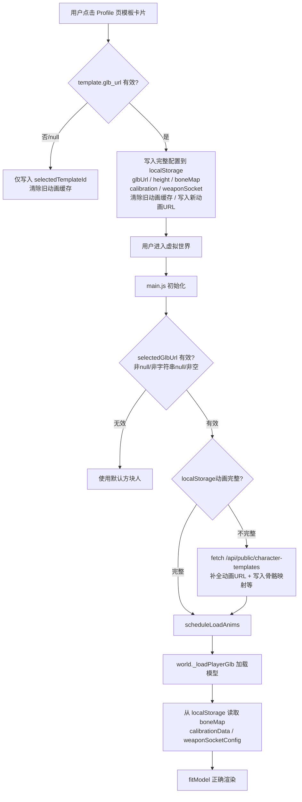

## 用户需求

用户反映：在虚拟世界中，通过 Profile 页面选择的新角色模板（如"123423"、标准动作模型、线上转换的 GLB）不显示模型，且骨骼绑定和模型校准配置不生效。

## 产品概述

角色模板选择系统：用户可在 Profile 页面选择角色外观模板，进入虚拟世界后渲染对应的 GLB 模型并应用动画、骨骼绑定、校准参数等配置。

## 核心问题

- **模型不显示（最高优先）**：Profile 页点击模板卡片时，若 `template.glb_url` 为 null，`localStorage.setItem('selectedTemplateGlbUrl', null)` 会存入字符串 `"null"`，而 `|| null` 无法识别字符串 `"null"`，导致 `world.js` 拼出 `http://host/null` 的 404 URL
- **旧动画缓存污染**：切换到新模板后，旧模板的 `selectedTemplateAnim_*` 仍留在 localStorage，API 补全逻辑误判为"已完整"而跳过重新拉取，加载了错误模板的动画
- **骨骼映射/校准/武器插槽配置缺失**：Profile 页选择模板时只写入 `selectedTemplateId` 和 `selectedTemplateGlbUrl`，不写入骨骼映射、校准参数、武器插槽等关键配置，进入世界时这些配置为空
- **API 补全逻辑不完整**：补全动画 URL 时只使用 `anim_{k}_url` 字段，未调用 `/anim-resolved` 接口，新动作库架构下可能获取不到正确动画 URL

## 技术栈

- 前端原生 JS（无框架），`localStorage` 作为跨页面状态传递媒介
- 修改文件：`public/js/main.js`（主要）、`public/js/world.js`（防御性补丁）

## 实现方案

### 修复策略

采用"在写入时修复"原则：在 Profile 页点击模板卡片的回调中，**立即**从已缓存的 API 数据中提取完整模板配置并写入 localStorage，同时清除旧模板的动画缓存。在 `main.js` 初始化读取时，加入字符串 `"null"` 的防御性过滤。`world.js` 中同步添加对应的防御检查。

### 关键技术决策

1. **Profile 页复用已有的 API 响应数据**：`loadCharacterTemplates()` 已经调用 `/api/public/character-templates` 获取完整模板列表，`forEach` 内部即可访问完整的 `template` 对象（含所有 `anim_*_url` 字段和配置），无需再发额外请求，**零网络开销**。

2. **模板切换时清除旧动画缓存**：在写入新模板 ID 前，检测旧的 `selectedTemplateId` 是否变更，若变更则批量 `removeItem` 清除所有 `selectedTemplateAnim_*` 键，保证新模板动画从 API 全量拉取。

3. **"null" 字符串防御**：在 `main.js` 初始化读取 `selectedGlbUrl` 时，增加 `=== 'null'` 检查；在 `world.js` `_loadPlayerGlb` 入口处同样增加检查，双重防护。

4. **补全逻辑兼容 anim-resolved 接口**：`main.js` 第 273 行的补全逻辑改为调用 `/api/public/character-templates` 后同时写入骨骼映射、校准、武器插槽等字段，使 Profile 页和游戏初始化路径对齐。

## 架构设计



## 目录结构

```
public/js/
├── main.js    [MODIFY] 
│   - loadCharacterTemplates() 的模板点击回调：清除旧动画缓存、写入完整配置
│   - 初始化读取 selectedGlbUrl 时过滤字符串 "null"
│   - API 补全逻辑同步写入骨骼映射等配置
│
└── world.js   [MODIFY]
    - _loadPlayerGlb() 入口：对字符串 "null" 的防御性检查
```

## 实现说明

- `main.js` Profile 点击回调中，遍历 `MVP_ANIM_KEYS` 将 `template[anim_${k}_url]` 写入 localStorage，无需额外请求
- 旧模板动画清除逻辑：`const oldId = localStorage.getItem('selectedTemplateId'); if (oldId && oldId !== String(template.id)) { MVP_ANIM_KEYS.forEach(k => localStorage.removeItem(...)); }`
- 字符串 `"null"` 过滤：`const selectedGlbUrl = (() => { const v = localStorage.getItem('selectedTemplateGlbUrl'); return (!v || v === 'null' || v.trim() === '') ? null : v; })()`
- `world.js` 防御补丁仅在 URL 有效性检查处追加 `|| url === 'null'` 判断，改动最小