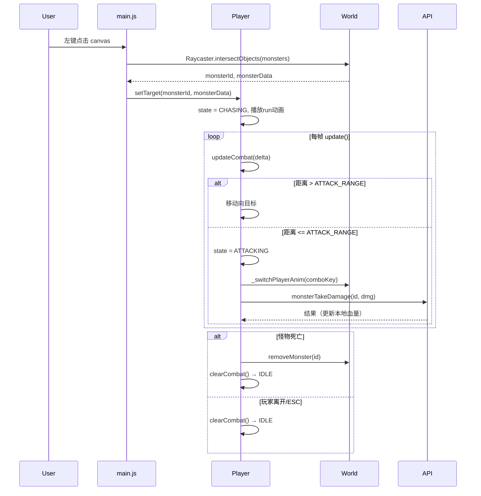

## 用户需求

为现有3D虚拟世界游戏实现完整的怪物战斗系统：点击怪物 → 自动追击 → 进入攻击范围后循环连击 → 战斗结束。

## 产品概述

在现有游戏世界（`index.html` + `player.js` + `world.js` + `main.js`）基础上，新增一套完整的怪物战斗流程，包含目标选中、自动寻路追击、7段连击循环动画、伤害结算和战斗退出逻辑。

## 核心功能

### 1. 怪物点击选中

- 鼠标左键点击场景中的怪物 3D 对象，通过 Raycaster 命中检测选中目标
- 选中后怪物头顶显示红色选中高亮光圈（选中指示器），并在 HUD 显示目标血条

### 2. 自动追击（Auto-Chase）

- 选中怪物后，玩家自动向目标跑去（播放 `run` 动画）
- 每帧在 `player.update()` 内检测距离：距离 > `ATTACK_RANGE` 时持续追击，覆盖 WASD 手动移动方向

### 3. 七段连击循环

进入攻击范围后，按固定顺序循环播放：
`attack1` → `attack_slash` → `attack_swing` → `attack_uppercut` → `attack_stab` → `attack2` → `attack3`，每段攻击命中时调用 `API.monsterTakeDamage()` 发送伤害。

### 4. 攻击节奏控制

- 每次动画播放期间锁定（`isAttacking` 标志），动画结束后自动触发下一段连击
- 动画时长映射表：各 key 配置对应 ms 时长，超时自动进入下段

### 5. 战斗结束

- **怪物死亡**：`world.removeMonster()` 移除怪物，清除目标，回到 `idle`
- **玩家主动离开**：玩家操作 WASD / 点击空地 / 按 ESC，取消当前战斗目标，停止追击并回到 `idle`
- **怪物超出范围**：若持续追击但距离始终未进入攻击范围（被障碍物阻挡等），超时后取消战斗

### 6. 目标血条 HUD（头顶跟随）

怪物名称与血条显示在怪物头顶（3D世界空间 → 屏幕空间投影），随怪物位置每帧更新，受伤时血条宽度实时缩减，怪物死亡或战斗结束时隐藏

## 技术栈

- 与现有项目保持一致：原生 JavaScript（ES6 class）+ Three.js（Raycaster）
- 复用现有 `player.js` / `world.js` / `main.js` / `api.js` 的全局变量与方法，不引入任何新依赖

## 实现方案

### 总体策略

在现有 `Player` 类中扩展战斗状态机（Combat State Machine），每帧在 `player.update()` 驱动状态转换；在 `main.js` 的鼠标点击事件中做 Raycaster 怪物拾取；HUD 以纯 DOM 方式注入 `index.html`。

状态机状态：

```
IDLE → [点击怪物] → CHASING → [进入范围] → ATTACKING → [怪物死亡/离开/ESC] → IDLE
```

### 关键技术决策

#### 1. Raycaster 怪物选中

在 `main.js` 的 `canvas` `click` 事件中（非 `mousedown`，避免误触拖拽），将点击坐标归一化后构造 `THREE.Raycaster`，对 `gameWorld.monsters` 中所有 `monsterGroup` 的子网格做 `intersectObjects` 检测；命中后找到对应 monsterId 传给 `player.setTarget()`。

#### 2. 自动追击（每帧驱动）

在 `player.update()` 末尾追加 `this.updateCombat(delta)`。若状态为 `CHASING`，计算目标位置方向向量，覆盖本帧移动（等效于注入 WASD 方向），并旋转角色朝向目标，播放 `run` 动画。距离满足 `<= CONFIG.ATTACK_RANGE + 0.5` 时切换到 `ATTACKING`。

#### 3. 七段连击序列

在 `player.js` 中定义连击序列数组和动画时长映射表：

```js
COMBO_SEQUENCE = ['attack1','attack_slash','attack_swing','attack_uppercut','attack_stab','attack2','attack3']
COMBO_DURATIONS = { attack1:900, attack_slash:700, attack_swing:800, attack_uppercut:750, attack_stab:700, attack2:800, attack3:1100 }
```

使用 `comboIndex` 指针循环遍历，每次 `setTimeout` 到期后自动触发下一段。攻击中 `isAttacking=true` 防止重入；同时检查距离，若目标已超出范围则停止连击。

#### 6. 头顶血条（3D→2D投影）

在 `index.html` 注入一个绝对定位的 `#monster-head-hud` 容器（包含怪物名称 + 血条），使用 `position: absolute; pointer-events: none`。

每帧在 `player.js` 的 `updateCombat()` 中，将怪物 `monsterGroup` 的世界坐标加上头顶偏移（`y + 3`）通过 `Vector3.project(camera)` 投影到 NDC，再换算为 CSS `left/top` 像素坐标更新 HUD 位置，血条宽度按 `currentHp / maxHp * 100%` 计算。

#### 5. 伤害计算

复用现有 `player.getAttackPower()` + 随机浮动，通过 `API.monsterTakeDamage(monsterId, damage)` 发 REST 请求，同时本地更新 `monsters.get(id).health` 以驱动 HUD 血条，避免等待服务端回包。

#### 5. 战斗中断

- WASD 键按下 → `clearCombat()` 取消追击（优先玩家控制）
- ESC 按下 → `clearCombat()`
- 怪物从 `world.monsters` 中消失（死亡/被服务端移除）→ `clearCombat()`
- 追击超时（5秒追不到）→ `clearCombat()`

### 性能注意

- Raycaster 仅在 `click` 事件触发，不在 `gameLoop` 内每帧调用，无性能开销
- `updateCombat()` 每帧执行，但只有 `CHASING/ATTACKING` 状态下才有计算，`IDLE` 时直接 early-return

## 架构设计



## 目录结构

```
public/
├── index.html                # [MODIFY] 新增头顶血条 DOM（#monster-head-hud）和绝对定位样式
├── js/
│   ├── player.js             # [MODIFY] 新增战斗状态机：setTarget / updateCombat / clearCombat / startComboAttack / nextComboAttack，扩展 update() 调用 updateCombat
│   ├── world.js              # [MODIFY] addMonster() 中给 monsterGroup 的子 Mesh 增加 userData.monsterId 标记；新增 showMonsterSelected / hideMonsterSelected 高亮方法
│   └── main.js               # [MODIFY] 在 setupKeyboardShortcuts() 的 canvas click 事件中增加 Raycaster 怪物拾取逻辑；ESC / WASD keydown 中调用 player.clearCombat()
```

## 关键代码结构

```js
// player.js 新增战斗状态常量与属性
const COMBAT_STATE = { IDLE: 'idle', CHASING: 'chasing', ATTACKING: 'attacking' };

// 连击序列和时长映射
const COMBO_SEQUENCE = ['attack1','attack_slash','attack_swing','attack_uppercut','attack_stab','attack2','attack3'];
const COMBO_DURATIONS = {
  attack1: 900, attack_slash: 700, attack_swing: 800,
  attack_uppercut: 750, attack_stab: 700, attack2: 800, attack3: 1100
};

// Player 类新增属性（constructor）
this.combatState = COMBAT_STATE.IDLE;
this.combatTarget = null;       // { id, data }
this.comboIndex = 0;            // 连击序列指针（7段）
this.combatChaseTimeout = null; // 追击超时计时器

// Player 新增方法签名
setTarget(monsterId, monsterData): void
updateCombat(delta): void
startComboAttack(): void
nextComboAttack(): void
clearCombat(): void
```